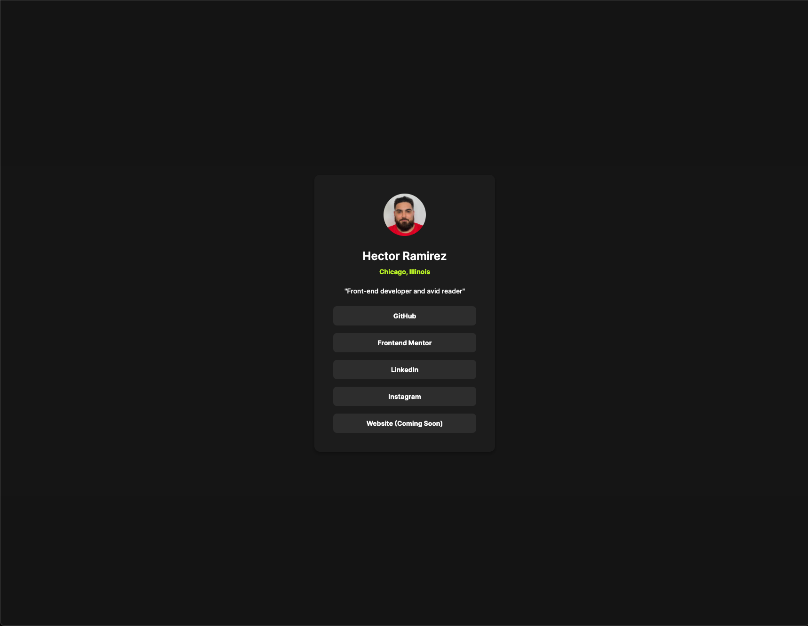

# Frontend Mentor - Social links profile solution

This is a solution to the [Social links profile challenge on Frontend Mentor](https://www.frontendmentor.io/challenges/social-links-profile-UG32l9m6dQ). Frontend Mentor challenges help you improve your coding skills by building realistic projects.

## Table of contents

- [Overview](#overview)
  - [The challenge](#the-challenge)
  - [Screenshot](#screenshot)
  - [Links](#links)
- [My process](#my-process)
  - [Built with](#built-with)
  - [What I learned](#what-i-learned)
  - [Continued development](#continued-development)
  - [Useful resources](#useful-resources)
- [Author](#author)

## Overview

### The challenge

Users should be able to:

- See hover and focus states for all interactive elements on the page

### Screenshot



### Links

- Solution URL: [Solution URL here](https://github.com/hectorlil48/social-links-profile-main)
- Live Site URL: [Live site URL here](https://hectorlil48.github.io/social-links-profile-main/)

## My process

### Built with

- Semantic HTML5 markup
- CSS custom properties
- Flexbox
- Media Queries

### What I learned

I learned from this project to use semantic HTML tags such as main and footer tags. I did not use them in the last project and I understand it is good practice to use semantic HTML tags for visually impaired people. I am also happy that my CSS skills are improving and it took me less time to start and finish this project compared to the last project I did.

```html
<main>Some HTML code I'm proud of</main>
<footer></footer>
```

```css
.links a {
  display: block;
  font-size: 14px;
  font-weight: 700;
  background-color: var(--grey);
  padding: 12px;
  border-radius: 8px;
  color: var(--white);
  text-decoration: none;
  transition: background-color 0.3s ease;
}

.links a:hover {
  background-color: var(--green);
  color: var(--dark-grey);
}
```

### Continued development

I want to keep practicing my HTML and CSS skills. I want to get better at making my websites responsive, So getting comfortable using responsive units like rem and em instead of px is something I need to get the hang of. I also want to get better at making my code more concise and better looking.

### Useful resources

- [Mdn](https://developer.mozilla.org/en-US/) - This helped me use media queries. Its always good to check out how to do something on CSS using MDN.
- [Stackoverflow](https://stackoverflow.com/) - StackOverflow is always helpful if I get stuck.

## Author

- GitHub - [Hector Ramirez](https://github.com/hectorlil48)
- Frontend Mentor - [@hectorlil48](https://www.frontendmentor.io/profile/hectorlil48)
- LinkedIn - [@linkedin.com/in/hector-ramirez-6a6509170](https://www.linkedin.com/in/hector-ramirez-6a6509170/overlay/contact-info/)
